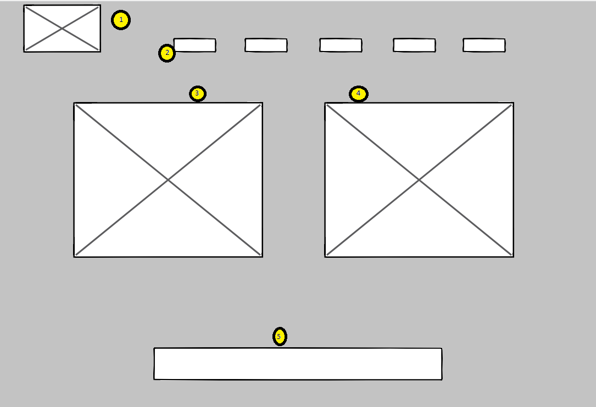
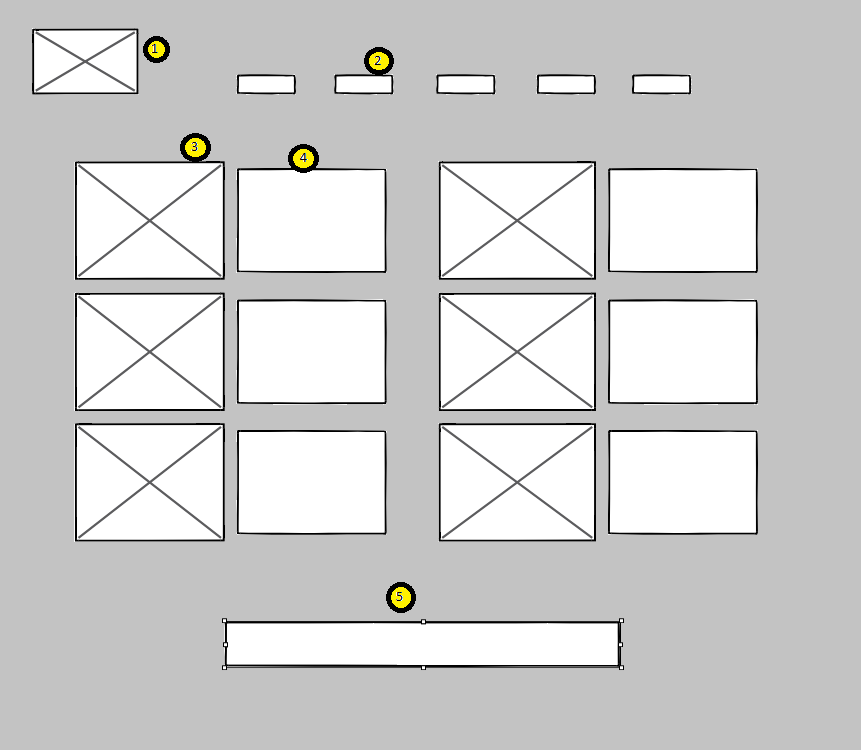
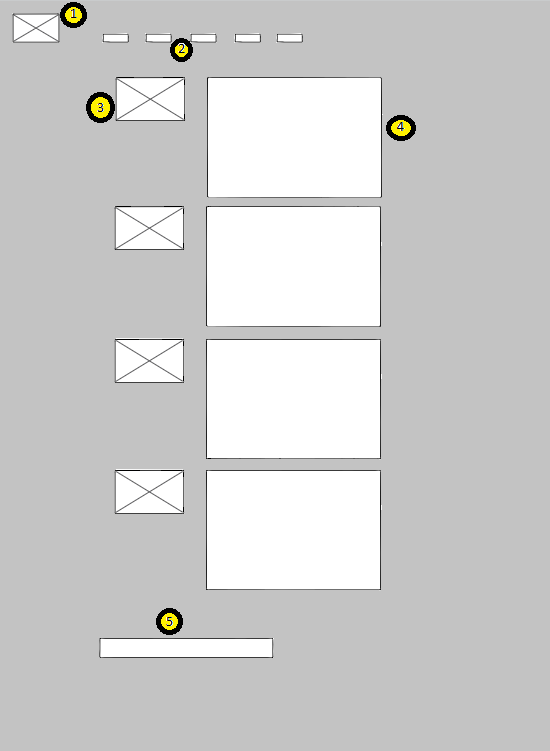
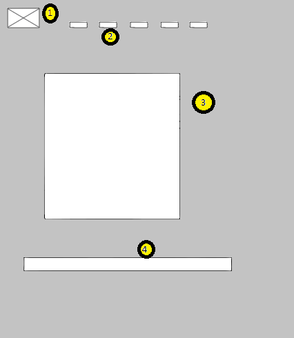
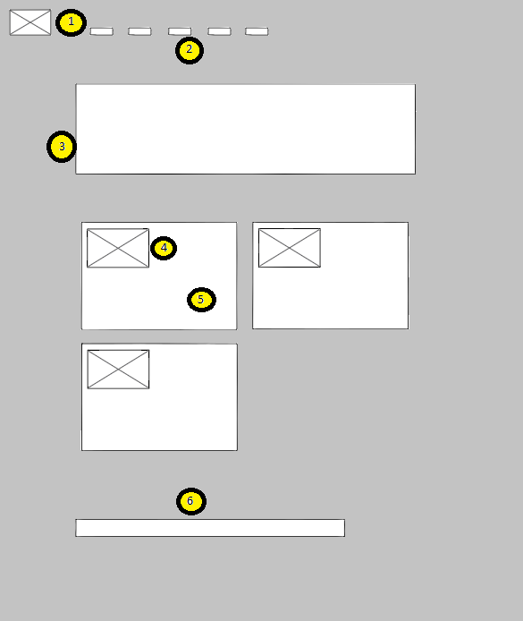

# INF 7429 Project Wireframe

### Design a website that displays stem kits and respective projects.

Planning the site information architecture will help with the implementation of the site.

# Homepage / Landing Page

1)	Logo/home page link
2)	Menu:

      1st menu item redundant home button

      2nd menu item products page

      3rd menu item projects page

      4th menu item order page

      5th menu item about page

  3&4 “Public Relations” graphic1 or headline and link to project/item, any events that support stem activities and links to them.

  5 Footer: copyright info and last updated date, included on all

# Products Page

  1&2 is the header and menu and will be included on all pages

  3 Images of hardware kits or completed projects

  4 Corresponding product description

  5 Footer: copyright info and last updated date

# Projects Page

  1&2 is the header and menu and will be included on all pages

  3 less detailed image of product

  4 project description/steps, potentially multiple iterations of projects for 1 kit.

  5 Footer: copyright info and last updated date

# Order Page

  1&2 is the header and menu and will be included on all pages

  3 order form

  4 Footer: copyright info and last updated date

# About / Contact Page

  1&2 is the header and menu and will be included on all pages

  3 Location and points of contact

  4 profile image

  5 bio info and individual contact

  6 Footer: copyright info and last updated date
